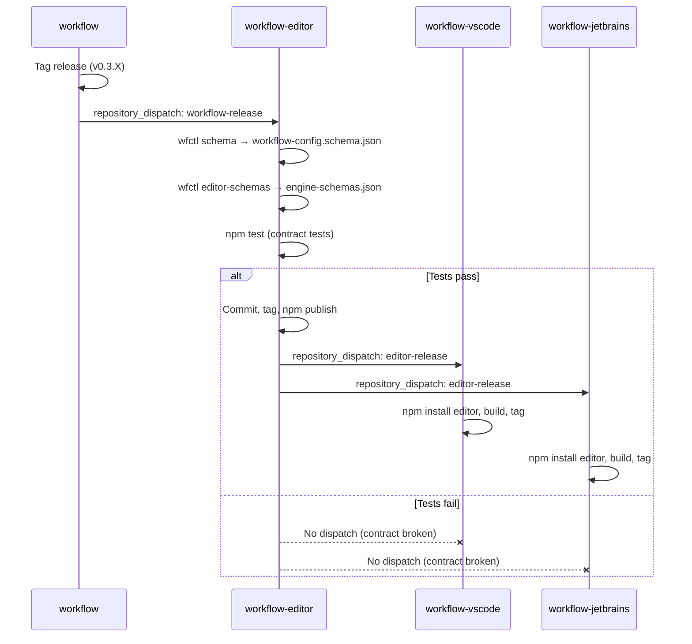

# Editor-Engine Contract Enforcement

**Date**: 2026-03-17
**Status**: Approved
**Repos**: workflow, workflow-editor, workflow-vscode, workflow-jetbrains

## Problem

The workflow visual editor has three drift/pollution issues:

1. **`ui_position` pollution** — Serialization writes `ui_position: {x, y}` into every module in YAML output. The engine silently ignores it, but the file is modified the moment it's opened.
2. **Hardcoded connection rules** — `connectionCompatibility.ts` has a 63-line `COERCION_RULES` map and static `ioSignature` definitions in `MODULE_TYPES` that are never updated when engine schemas change. `mergeSchemas()` explicitly preserves static values over server schemas.
3. **Minimal validation** — Editor only checks required fields. No validation against the engine's JSON schema, no connection validity checking. Nothing prevents producing configs the engine rejects.

## Design

### 1. Position Sidecar File

Store layout in a `.workflow-editor.json` sidecar file alongside the YAML config.

- `nodesToConfig()` stops writing `ui_position` into modules
- `configToYaml()` returns clean YAML (engine-compatible fields only)
- New `exportLayout(nodes)` → `LayoutData` and `importLayout(nodes, layout)` functions
- Sidecar format:
  ```json
  {
    "version": 1,
    "positions": {
      "<module-name>": { "x": 100, "y": 200 }
    }
  }
  ```
- IDE plugins read/write the sidecar via the editor's API
- If sidecar is missing, dagre auto-layout kicks in (existing behavior)
- Add `.workflow-editor.json` to `.gitignore` suggestions in IDE plugins

### 2. Engine-Derived Connection Rules

New `wfctl editor-schemas` command replaces hardcoded editor metadata.

**Engine side (workflow repo):**
- `cmd/wfctl/editor_schemas.go`: exports `ModuleSchemaRegistry.AllMap()` as JSON
- New `TypeCoercionRegistry` in `schema/coercion.go`: moves the `COERCION_RULES` source of truth into Go, exported alongside module schemas
- Output format:
  ```json
  {
    "moduleSchemas": { "<type>": { "type": "...", "inputs": [...], "outputs": [...], ... } },
    "coercionRules": { "http.Request": ["any", "PipelineContext"], ... }
  }
  ```
- `sync-schema.yml` already dispatches to workflow-editor; extend to also export editor-schemas

**Editor side (workflow-editor repo):**
- `sync-schema.yml` runs `wfctl editor-schemas --output src/generated/engine-schemas.json`
- `moduleSchemaStore.ts` loads generated file as **primary** source; static `MODULE_TYPES` becomes fallback
- `connectionCompatibility.ts` reads `COERCION_RULES` from generated file
- `mergeSchemas()` inverted: engine schemas take priority, static fills gaps only

### 3. CI Golden-File Contract Tests

**Engine side (`schema/editor_contract_test.go`):**
- Exports `ModuleSchemaRegistry.AllMap()` + `TypeCoercionRules()` to golden file
- Test fails if golden file differs from current output (forces deliberate `go test -update` on schema changes)
- Golden file: `schema/testdata/editor-schemas.golden.json`

**Editor side (`src/utils/serialization.contract.test.ts`):**
- Loads engine JSON schema (`schemas/workflow-config.schema.json`)
- For ~10 representative configs (HTTP server, pipeline, state machine, conditional, middleware chain):
  1. Parse YAML → nodes/edges
  2. Modify graph (add node, connect, configure)
  3. Serialize back to YAML
  4. Validate output against engine JSON schema via `ajv`
  5. Assert no `ui_position` or editor metadata in output
- Snapshot golden files for round-trip stability

**CI enforcement (`sync-schema.yml` addition):**
- After regenerating schemas, run `npm test` before committing
- If contract tests fail, sync stops (no tag, no dispatch to IDE plugins)

### 4. Cross-Repo Flow



### 5. Changes Per Repo

| Repo | Files | What |
|------|-------|------|
| workflow | `cmd/wfctl/editor_schemas.go` | New `editor-schemas` command |
| workflow | `schema/coercion.go` | `TypeCoercionRegistry` (source of truth) |
| workflow | `schema/editor_contract_test.go` | Golden file test |
| workflow | `schema/testdata/editor-schemas.golden.json` | Golden file |
| workflow-editor | `src/utils/serialization.ts` | Strip `ui_position`, add sidecar layout API |
| workflow-editor | `src/generated/engine-schemas.json` | Generated file (auto-updated by CI) |
| workflow-editor | `src/stores/moduleSchemaStore.ts` | Load generated schemas as primary source |
| workflow-editor | `src/utils/connectionCompatibility.ts` | Read coercion rules from generated file |
| workflow-editor | `src/utils/serialization.contract.test.ts` | Round-trip contract tests |
| workflow-editor | `.github/workflows/sync-schema.yml` | Add `wfctl editor-schemas` + `npm test` |
| workflow-vscode | `src/extension.ts` (or similar) | Pass sidecar path to editor |
| workflow-jetbrains | (webview bridge) | Pass sidecar path to editor |
