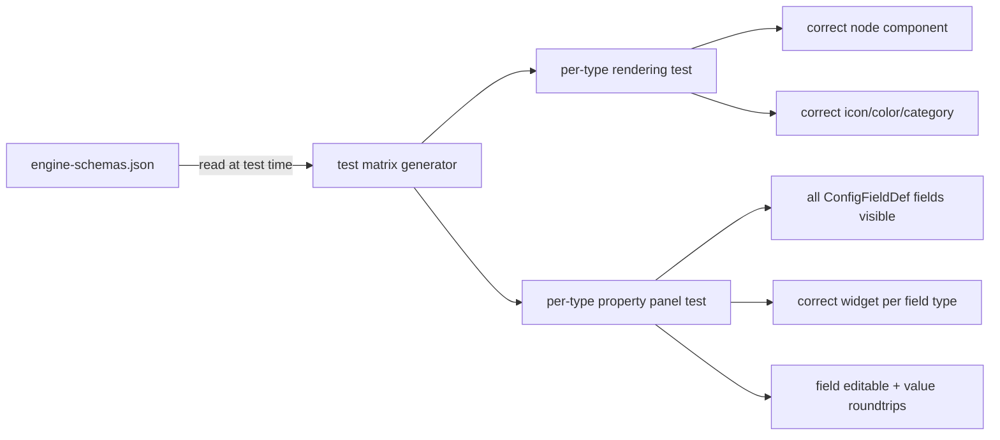
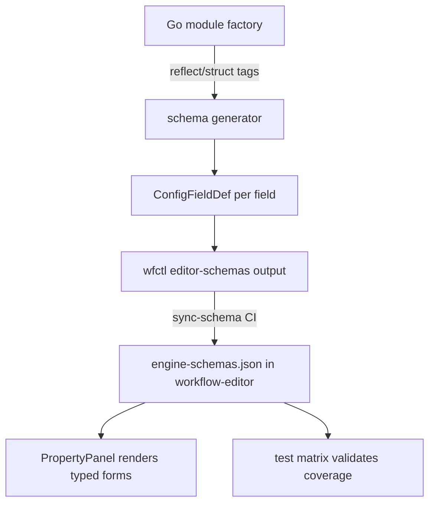
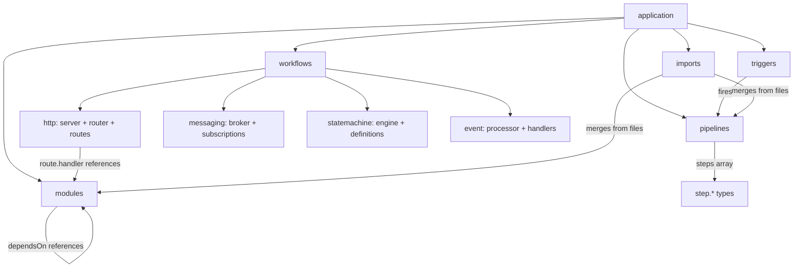

# Editor Completeness: Schema-Driven Testing, Typed Forms, DSL Reference & Navigation

**Date:** 2026-03-27
**Status:** Approved
**Repos:** workflow-editor, workflow, workflow-vscode, workflow-jetbrains

## Overview

Five interconnected workstreams to ensure every aspect of the workflow YAML DSL renders correctly in the visual editor, every node's attributes are visible and editable with proper form widgets, and users can understand and navigate the DSL whether they're in the visual editor, an IDE, or writing raw YAML.

## 1. Schema-Driven Test Matrix

Auto-generate rendering and property panel tests for every module type from `engine-schemas.json`. New types added via schema sync automatically get test coverage.

### Architecture



### Implementation

- `src/utils/schema-matrix.test.ts` — reads `engine-schemas.json`, iterates every module type
- For each type: creates a minimal config → `configToNodes()` → asserts correct `nodeComponentType` mapping → asserts node data has correct category color
- For each type with `configFields`: mounts `PropertyPanel` with a selected node of that type → asserts every field renders with the correct widget type → asserts editing a field calls `updateNodeConfig`
- `describe.each()` pattern so vitest shows one named test per module type
- When schema sync adds a new type, the test matrix auto-expands

### Coverage

- Pipeline step nodes (synthesized) — verify they render as `integrationNode`
- Conditional nodes — verify diamond shape, handle layout per subtype
- Partial YAML — verify modules-only, pipelines-only, imports-only all render without errors

## 2. Typed Schema Generation (Workflow Engine)

Eliminate `type: "json"` catch-all fields by generating proper typed schemas from Go structs. This becomes the authoritative schema source and represents a major version bump.

### Architecture



### Workflow Engine Changes

- Each module's config struct already has `json`/`yaml` tags. Add struct tags for editor metadata: `editor:"type=select,options=postgres|mysql|sqlite"`, `editor:"description=Database connection string"`, `editor:"required"`
- New `pkg/schema/` package that reflects on config structs → produces `[]ConfigFieldDef`
- `wfctl editor-schemas` enhanced to include full typed fields instead of bare type names
- Every module factory registers its config struct type so the generator can iterate all

### Validation Contract

- CI test in workflow repo: for every registered module type, assert `editor-schemas` produces a non-empty `configFields` array with zero `type: "json"` fields
- Any new module that ships with a `json`-typed field fails CI
- Go type safety flows all the way through to the visual editor

### Migration Path

1. Add schema generator + struct tags to workflow engine (one module at a time)
2. When all ~70 types have proper schemas → major version bump
3. workflow-editor removes the static `MODULE_TYPES` fallback array — engine schema is authoritative
4. The test matrix catches any regressions

## 3. DSL Documentation + Reference System

Make the DSL spec understandable everywhere — in the visual editor, in IDE YAML editing, and in standalone docs.

### DSL Hierarchy



### Layer 1: Canonical DSL Reference (workflow repo)

- `docs/dsl-reference.md` — the authoritative spec
- Sections: application, modules, workflows (http/messaging/statemachine/event), pipelines, triggers, imports, config providers, sidecars, platform, infrastructure
- Each section: purpose, required fields, optional fields, relationship to other sections, minimal example
- Machine-parseable frontmatter per section so consumers can extract structured data
- Generated from engine source where possible (module type list, step type list, trigger type list)
- `wfctl docs` command to render the reference locally

### Layer 2: Editor DSL Reference Pane (workflow-editor)

- Collapsible sidebar pane (like PropertyPanel) with a book icon in toolbar
- Content loaded from bundled `dsl-reference.json` (extracted from markdown at build time, synced alongside engine-schemas.json)
- **Context-sensitive:** when a node is selected, pane auto-scrolls to the relevant section
- **Section hierarchy:** mirrors the YAML structure — click through application → modules → specific type
- Includes inline YAML examples that match the visual canvas representation
- Shares the right panel area as a tab alongside YAML pane when both are active

### Layer 3: IDE Plugin Integration (workflow-vscode + workflow-jetbrains)

- **Hover tooltips:** cursor on a YAML key (`modules:`, `workflows:`, `pipelines:`) shows the DSL reference description
- **Autocomplete descriptions:** YAML language server suggestions include DSL reference detail
- **Command palette:** `Workflow: Show DSL Reference` opens the reference as a webview or markdown preview
- Both plugins already have the webview bridge — the reference pane from Layer 2 works inside the IDE webview

## 4. Navigation — Breadcrumbs + Interactive File Groups

### Breadcrumb Bar

```
┌──────────────────────────────────────────────────────────────┐
│ 📁 app.yaml › domains/ › auth.yaml › login pipeline         │
└──────────────────────────────────────────────────────────────┘
```

- Renders above the canvas, below the toolbar
- Shows current file context path based on selected node's `sourceFile`
- Each segment clickable: root config, directories, files, pipeline names
- When no node selected, shows just the root config path
- In IDE mode: clicks call `onNavigateToSource(filePath, 1, 0)` to open in IDE

### Interactive File Groups

Enhance existing `FileGroupNode` (currently `pointer-events: none`):

- **Group header clickable:** clicking the filename label navigates to that file
- **Group border clickable:** clicking the border pans + zooms canvas to fit that file's nodes
- **Double-click group:** opens file in YAML pane or triggers IDE navigation
- **Visual affordance:** pointer cursor on hover, subtle highlight on border
- Keep `pointer-events: none` on group background so contained nodes remain clickable

### Cross-File Node Interaction

When clicking a node in a different file group:
1. Selects the node
2. Updates breadcrumb to reflect new file context
3. YAML pane switches to that file's tab and highlights node's lines
4. IDE mode calls `onNavigateToSource(filePath, line, col)`

### Partial Config "Navigate to Parent"

- Breadcrumb shows `? › domains/ › auth.yaml` when parent unknown
- If root config resolved via `discoverConfigRoot`, shows `app.yaml › domains/ › auth.yaml`
- Clicking root in breadcrumb: standalone calls `onNavigateToSource`, IDE opens the file + loads merged view
- "View full config" button in toolbar when partial loaded

## 5. Property Panel Completeness Testing

Assert every node type's attributes are visible and editable when selected.

### Test Structure (per module type)

1. **All fields rendered:** visible field editor count === `configFields.length` in schema
2. **Correct widget type:** string→text input, number→number input, boolean→checkbox, select→dropdown with correct options, array→ArrayFieldEditor, map→MapFieldEditor, json→textarea (flagged as tech debt), sql→SqlEditor, sensitive→password input, filepath→FilePicker
3. **Field metadata:** label matches `field.label`, description/placeholder shown, required indicator when `field.required`
4. **Editing roundtrips:** change value → `updateNodeConfig` called with correct key/value → node config reflects change
5. **Inheritance rendering:** fields with `inheritFrom` show inherited value in italic green
6. **Special editors:** ConditionalCasesEditor for `conditional.switch`, MiddlewareChainEditor for `http.router`, HandlerRoutesEditor for `api.query`/`api.command`

### Coverage Contract

- Module type with zero `configFields` → assert just name + type badge + delete (no config section)
- Module type with `json`-typed field → test passes but logs warning: `TECH DEBT: ${type}.${field} uses json textarea`
- CI can fail on `json` fields once engine migration complete — controlled by `STRICT_SCHEMA=true` env var

## Implementation Phases

### Phase 1: Schema-Driven Tests (workflow-editor)
- Schema matrix test generator
- Property panel completeness tests
- Partial config rendering tests
- All driven from engine-schemas.json

### Phase 2: Navigation UX (workflow-editor)
- Breadcrumb bar component
- Interactive file groups (enhance FileGroupNode)
- Cross-file node click → breadcrumb + YAML pane sync
- Partial config "navigate to parent" + "View full config" button

### Phase 3: DSL Reference (workflow + workflow-editor)
- DSL reference markdown in workflow repo
- `dsl-reference.json` build/sync pipeline
- DSL Reference pane component in workflow-editor
- Context-sensitive section linking

### Phase 4: Typed Schema Generation (workflow engine)
- `pkg/schema/` generator from Go struct tags
- Editor struct tags on module configs (incremental per module)
- `wfctl editor-schemas` enhancement
- CI contract: no `json`-typed fields
- Major version bump when complete

### Phase 5: IDE Integration (workflow-vscode + workflow-jetbrains)
- Breadcrumb click → file navigation
- DSL reference hover tooltips
- Autocomplete with DSL descriptions
- `Workflow: Show DSL Reference` command
