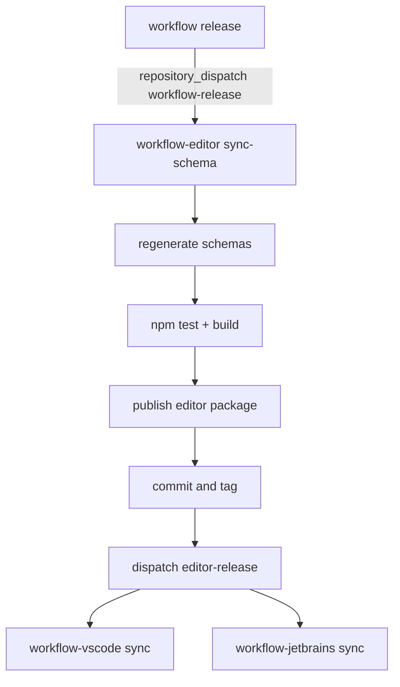
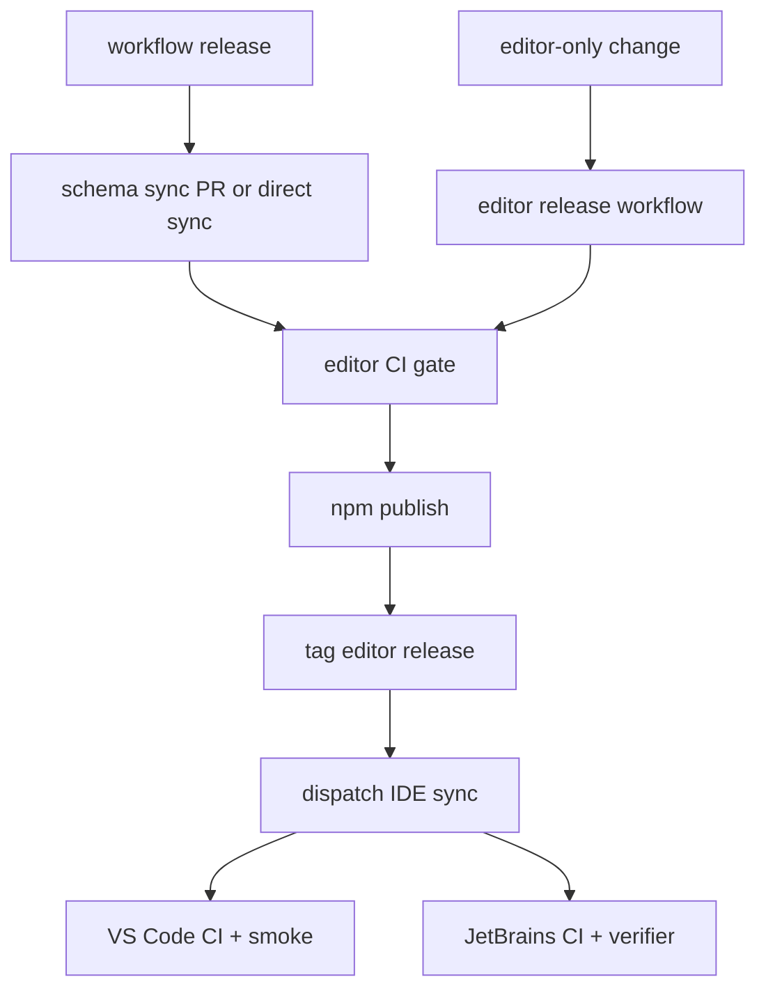

# Editor and IDE Quality, Usability, and Release Independence

**Date:** 2026-04-27
**Status:** Ready for implementation after Workflow PR 500 is merged
**Repos:** workflow-editor, workflow-vscode, workflow-jetbrains, workflow

## Overview

`workflow-editor` is now a shared authoring surface for standalone editor usage, VS Code, JetBrains, and Workflow-driven projects. It has strong unit coverage in some schema and serialization areas, but the actual release path still has gaps:

- E2E tests exist but are not part of CI.
- Several early Playwright tests are placeholders.
- Local `npm test` currently fails under Node 25 with a `localStorage` persistence issue, while CI pins Node 22.
- Editor releases are usually triggered by Workflow releases, making editor-only fixes harder to publish independently.
- IDE plugin syncs consume editor releases, but IDE compatibility and smoke tests are not strong enough.
- `wfctl.yaml` and IaC YAML are not covered consistently in editor or IDE workflows.

This design makes release quality explicit and gives the editor a path to ship between Workflow releases.

## Current Release Shape

Problems:

- `sync-schema.yml` publishes before committing/tagging generated changes.
- `sync-schema.yml` does not run Playwright E2E tests.
- `build.yml` does not run Playwright E2E tests.
- `publish.yml` is manual fallback only and does not support a normal editor-only release train.
- IDE plugin tests do not prove the webview is usable after package bumps.
- JetBrains declares conflicting compatibility in code vs README.

## Target Release Shape

Key changes:

- Editor has first-class editor-only release workflow.
- Workflow release sync is one input into editor releases, not the only path.
- CI gates include TypeScript, unit tests, build, Playwright E2E, and static analysis.
- IDE sync PRs or branches run compatibility checks before release.

## Testing Strategy

### Unit and Integration Tests

Keep current Vitest coverage and add missing global test setup:

- Stable `localStorage` implementation for Zustand persistence in test environment.
- No accidental reliance on Node-specific browser globals.
- Schema and serialization tests for `app.yaml`, `infra.yaml`, and `wfctl.yaml`.
- Editor bundle tests from the strict contract plan.

### Playwright E2E

Convert placeholder tests into real workflows:

- Load sample app YAML and verify nodes render.
- Add a node from palette and verify canvas plus YAML update.
- Select node, edit property, verify YAML update.
- Open YAML pane, edit/select lines, verify canvas selection.
- Use DSL reference pane and verify context-sensitive navigation.
- Load multi-file workspace and verify cross-file navigation.
- Load strict-contract sample bundle and verify contract indicators.
- Load IaC/wfctl sample workspace and verify file-type presentation.

E2E matrix:

- Desktop Chromium in CI for every PR.
- Optional local WebKit/Firefox smoke for release candidates.
- Screenshots/videos retained on failure.

### Exploratory Testing

Add a repeatable Playwright CLI checklist for human/agent-driven exploratory testing:

- Standalone browser editor.
- VS Code webview.
- JetBrains webview.
- Multi-file Workflow app.
- IaC/wfctl project config.
- Strict-contract plugin sample.

Exploration outputs should be stored as short markdown notes or CI artifacts, not buried in chat.

### Static Analysis and Local Quality

Add or enable:

- `npm run lint` in CI once ESLint config is stable.
- `npm audit --audit-level=high` as an advisory check initially, then a required check after current high vulnerabilities are triaged.
- TypeScript `npx tsc --noEmit`.
- Playwright E2E in CI.
- Package manager and Node version pinning with `.nvmrc` or `.node-version`.

## IDE Compatibility

VS Code:

- Keep extension engine compatibility explicit.
- Run compile/test/package on sync PRs.
- Add a minimal extension host test for opening a Workflow YAML and loading the editor webview.
- Add schema association tests for `app.yaml`, `infra.yaml`, and `wfctl.yaml`.

JetBrains:

- Resolve README vs `sinceBuild` mismatch.
- Run Gradle test/build and plugin verifier for the declared compatibility window.
- Add smoke tests for webview asset loading after editor sync.
- Add file-type/schema association tests for `app.yaml`, `infra.yaml`, and `wfctl.yaml`.

## Release Independence

Editor releases should support:

- `workflow-release` dispatch for schema/bundle sync.
- Manual `workflow_dispatch` for editor-only patches.
- Tag-driven release from `workflow-editor` without requiring a new Workflow tag.
- IDE dispatch using the actual editor package version, not necessarily the Workflow version.

Versioning:

- If generated Workflow schema/bundle changes, editor version may match Workflow for compatibility.
- If editor-only code changes, bump patch version independently.
- IDE plugins should consume `@gocodealone/workflow-editor` by exact released version after sync, not broad ranges in generated release branches.

## Acceptance Criteria

- `workflow-editor` CI runs TypeScript, Vitest, build, and Playwright E2E.
- Placeholder Playwright tests are replaced with real user workflows.
- Local tests run consistently on the documented Node version.
- Editor can publish an editor-only release and dispatch IDE syncs.
- VS Code and JetBrains sync workflows run compatibility checks before publishing or tagging.
- `app.yaml`, `infra.yaml`, and `wfctl.yaml` are covered in editor and IDE tests.
