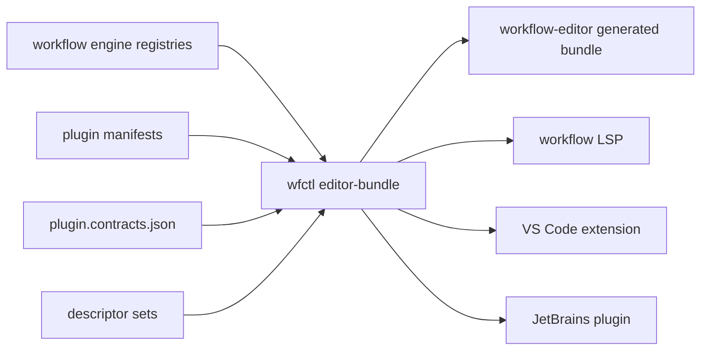

# Strict gRPC Contract Support in Workflow Editor and IDEs

**Date:** 2026-04-27
**Status:** Ready for implementation after Workflow PR 500 is merged
**Repos:** workflow, workflow-editor, workflow-vscode, workflow-jetbrains

## Overview

Workflow's strict gRPC go-plugin contract mode gives plugins typed module, step, service, and message descriptors. The editor stack currently consumes module schemas, step schemas, coercion rules, and DSL reference data, but it does not understand strict contract mode, plugin contract metadata, descriptor-backed message types, or `wfctl.yaml` project metadata.

The goal is to make strict contracts visible and actionable across the full authoring surface:

- `wfctl` exports a canonical editor contract bundle.
- `workflow-editor` loads and presents strict contract metadata for built-in and plugin-provided nodes.
- Node palettes, property panels, validation, YAML round-trip, and connection compatibility understand typed inputs and outputs.
- VS Code and JetBrains plugins associate `app.yaml`, `infra.yaml`, and `wfctl.yaml` with the right schemas and pass the same contract bundle into the editor webview.

## Current Gaps

`workflow-editor` has these gaps:

- `src/generated/load-schemas.ts` only loads `moduleSchemas`, `stepSchemas`, and `coercionRules`.
- `PluginSchemaData` only supports plugin module schemas; there is no contract registry, step contract, message descriptor, or strict-mode flag.
- The palette can label plugin-provided module types through `pluginSource`, but does not show contract mode, strictness, or descriptor provenance.
- The property panel can render `ConfigFieldDef` fields, but cannot show typed message schemas, request/response payload contracts, or descriptor-backed nested forms.
- Validation is mostly parse-time and test-time. There is no live AJV/schema validation of authoring data against a contract bundle and no `wfctl validate` bridge for host environments.
- `wfctl.yaml` is not modeled as an editor-supported file, schema, or IDE-associated file type.
- IaC DSL support exists only indirectly through generated modules and steps; top-level `infrastructure`, `sidecars`, provider state, and `wfctl` project config are not first-class authoring surfaces.

The Workflow side has these gaps:

- The strict contract work already introduces `ContractRegistry`, `ContractDescriptor`, strict/proto-with-legacy modes, descriptor sets, SDK provider interfaces, and `wfctl plugin init` scaffolding.
- `wfctl editor-schemas` does not export those strict contract descriptors.
- Runtime HTTP schema endpoints expose module schemas but not a complete editor bundle with steps, contracts, snippets, DSL reference, and config schemas.
- LSP/plugin schema loading is not yet aligned with the editor bundle, so IDEs and the visual editor can drift.

## Design

### Canonical Editor Bundle

Add a single generated bundle produced by `wfctl editor-bundle` and optionally by `wfctl editor-schemas --bundle`.



Bundle contents:

- `version`: Workflow version and bundle schema version.
- `moduleSchemas`: existing module schema map.
- `stepSchemas`: existing pipeline step schema map.
- `coercionRules`: existing compatibility matrix.
- `contracts`: strict contract registry keyed by plugin, module type, step type, and service.
- `messages`: normalized message descriptors suitable for UI rendering and validation.
- `descriptorSets`: references or embedded compressed descriptor material, depending on size.
- `dslReference`: existing DSL reference JSON.
- `schemas`: JSON schemas for `app.yaml`, `infra.yaml`, and `wfctl.yaml`.
- `snippets`: YAML snippets and examples from `wfctl snippets`.

The bundle is the source of truth. `workflow-editor` should keep compatibility wrappers for existing `engine-schemas.json`, but new work should flow through the bundle.

### Contract Shape

Contracts should be normalized for editor usage rather than exposing raw protobuf descriptor internals everywhere.

```typescript
interface EditorContractBundle {
  version: string;
  workflowVersion: string;
  moduleSchemas: Record<string, EngineModuleSchema>;
  stepSchemas: Record<string, EngineStepSchema>;
  coercionRules: Record<string, string[]>;
  contracts: Record<string, EditorContractDescriptor>;
  messages: Record<string, EditorMessageDescriptor>;
  schemas: {
    app: JsonSchema;
    infra?: JsonSchema;
    wfctl?: JsonSchema;
  };
  snippets: EditorSnippet[];
}

interface EditorContractDescriptor {
  id: string;
  plugin?: string;
  ownerType: 'module' | 'step' | 'service';
  ownerKey: string;
  mode: 'strict' | 'proto_with_legacy' | 'legacy';
  requestMessage?: string;
  responseMessage?: string;
  configMessage?: string;
  descriptorSetRef?: string;
  source: 'builtin' | 'plugin-manifest' | 'plugin-contracts-json' | 'live-plugin';
}
```

### Editor Presentation

Node palette:

- Add a compact strict-contract indicator for module and step types with contract descriptors.
- Group plugin nodes by plugin, preserving existing category grouping.
- Hide or de-emphasize legacy-only plugin nodes when strict mode is required by project policy.

Node body:

- Show typed input/output labels derived from strict contracts when available.
- Preserve existing connection handles but derive compatibility from contract output and input message names when stricter than current coercion rules.

Property panel:

- Add a Contract section showing mode, plugin source, request/response/config messages, and descriptor source.
- Render descriptor-backed config messages as nested typed fields when a field has no better `ConfigFieldDef` mapping.
- Preserve existing field editors for standard `ConfigFieldDef` fields.

Validation:

- Add live validation against the editor bundle for selected node config and YAML edits.
- In host environments, expose a callback for `wfctl validate --json` so IDEs can show authoritative diagnostics.
- Treat strict mode violations as errors and legacy-mode usage under strict policy as warnings or errors based on project config.

### `wfctl.yaml` and IaC Support

Add file-level support rather than treating these as arbitrary YAML:

- `app.yaml` / `app.yml`: Workflow application DSL.
- `infra.yaml` / `infra.yml`: provider/project infrastructure DSL where present.
- `wfctl.yaml` / `wfctl.yml`: project tool config, plugin lock policy, validation policy, registries, environments, secrets sinks, and release/deploy defaults.

The editor should expose these files as tabs or workspace resources, not just as imported application fragments.

IaC support should include:

- Top-level `infrastructure` and `sidecars` visualization.
- Provider, environment, and state-store metadata display.
- Provider-specific extension panels only when the bundle exposes provider capabilities.
- Destructive operation policy metadata for future human-in-the-loop deploy gates.

### IDE Integration

VS Code and JetBrains should:

- Associate `wfctl.yaml`, `wfctl.yml`, `infra.yaml`, and `infra.yml` with schemas.
- Start or invoke `wfctl` to generate the same editor bundle used by the visual editor.
- Pass the bundle into the webview via existing schema callbacks.
- Surface strict contract diagnostics through LSP or extension diagnostics.
- Keep editor package bumps independent from Workflow releases when only webview/editor code changed.

## Compatibility

- Existing `engine-schemas.json` remains readable.
- Existing `onSchemaRequest` and `onPluginSchemaRequest` stay supported.
- New hosts should prefer `onEditorBundleRequest`.
- Legacy plugins still render, but strict-mode project policy can warn or block them.
- Bundle schema versioning must be explicit so IDE plugins can reject unsupported bundles cleanly.

## Acceptance Criteria

- `wfctl editor-bundle --output editor-bundle.json` includes modules, steps, coercion rules, contracts, messages, DSL reference, snippets, and YAML schemas.
- `workflow-editor` loads a bundle and renders strict contract metadata for at least one built-in strict contract and one plugin-provided strict contract.
- Contract metadata round-trips through node selection, property panel editing, YAML serialization, and validation.
- `wfctl.yaml` and IaC YAML files have schema support in the editor and both IDE plugins.
- Tests prove strict, proto-with-legacy, and legacy contract modes display and validate correctly.
- IDE plugins can consume a newer editor package release without requiring a new Workflow release.
